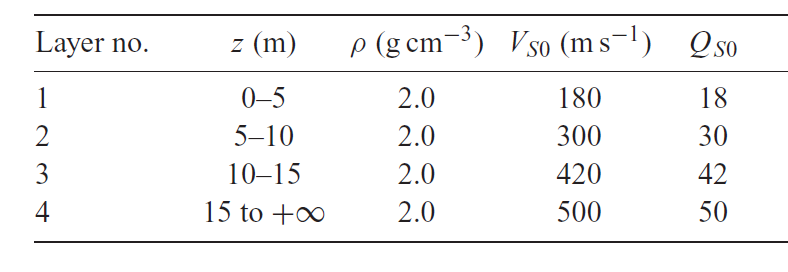
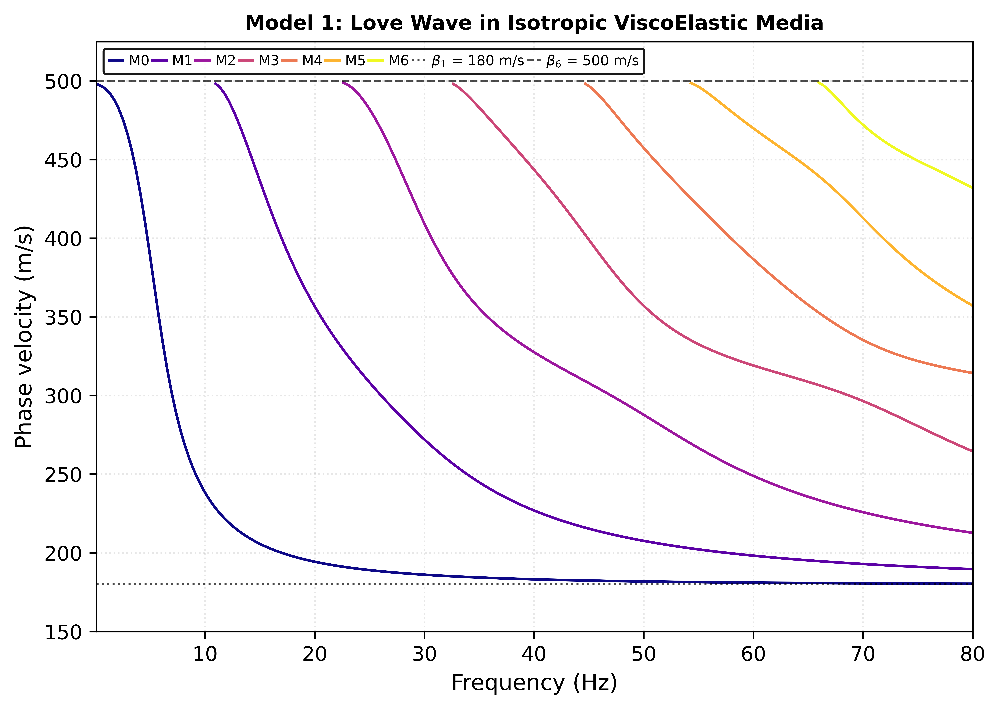
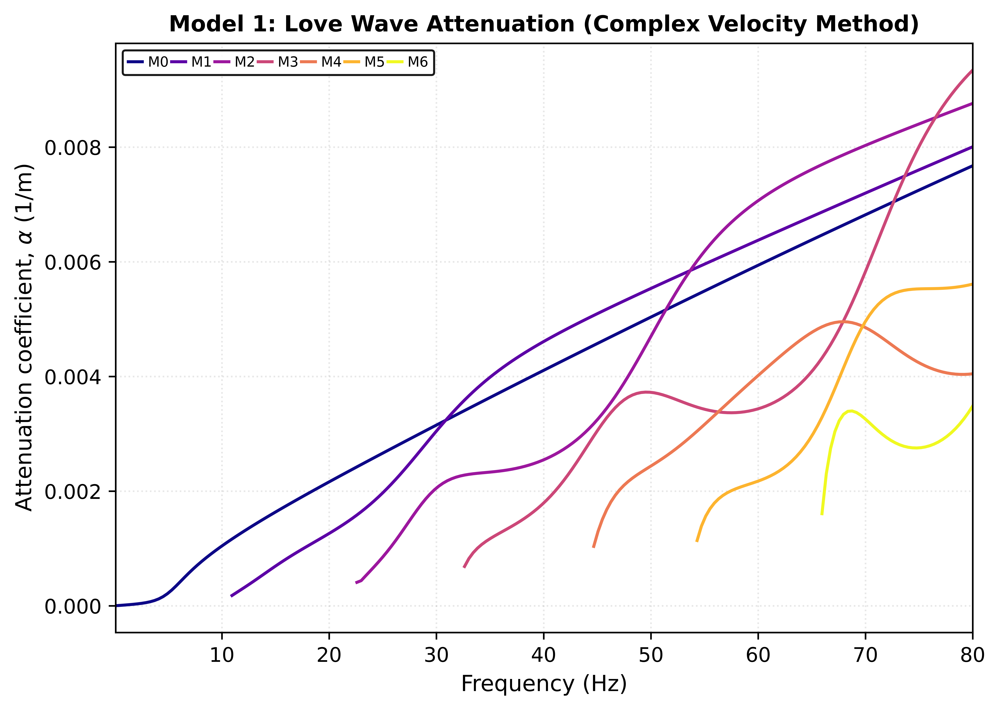
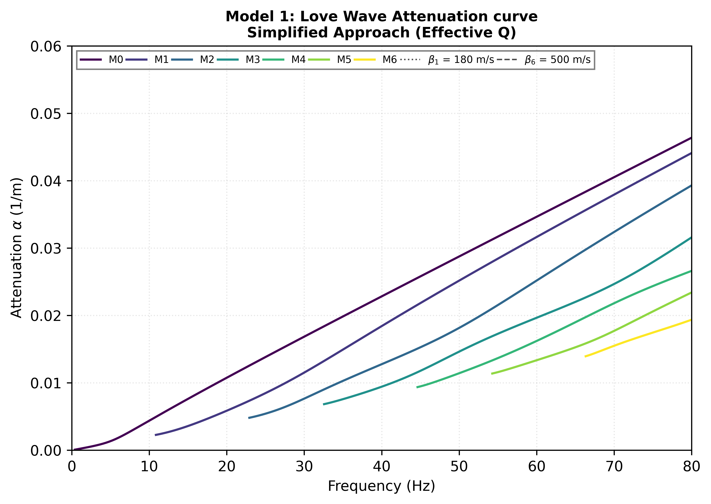

# Dispersion and Attenuation of Love Waves in a Stack of N Isotropic Viscoelastic Layers over a Half-Space: A Thomson-Haskell Propagator Matrix Approach.

This repo contains detailed mathematical derivations and Python code for my Geophysical Wave Propagation (GEOP 602) semester project on the <u><b>dispersion and attenuation study of Love waves in an isotropic viscoelastic medium<b></u>. 

The theoretical framework follows the classic work of [Haskell (1953)](#haskell-1953) and [Thomson (1950)](#thomson-1950) as implemented in [Chen k. et al. (2025)](#Chenetal2025). Model 1 used in my project is from [Yuan S. et al (2024)](#Yuanetal) (Table 4 of [Yuan S. et al (2024)](#Yuanetal)). The attanuation coefficient is computed via complex velocity approach 

<b>Phase Velocity Dispersion Curve (Uisng Complex Velocity Method)<b>

<b>Attenuation Coefficient Curve (Simplified Q averaging):<b> This assumes that attenuation is very small (Q>>1) and its computed using the Kolsky-Futterman model (see attached code for derivation).

For small attenuation (\( Q >> 1 \)), the standard formulation is:

where \( c \) is the real-valued phase velocity at low loss.

Starting from the wavenumber:

Comparing this to , we immediately identify:

<b>Attenuation Coefficient Curve<b>

<b>The Love-wave modal solutions in the frequency-phase velocity-attenuation coefficient domain.<b>

---

## References

1. **Yuan, S., Pan, L., Shi, C., Song, X., & Chen, X. (2024).**  
   *Computation and analysis of surface wave dispersion and attenuation in layered viscoelastic–vertical transversely isotropic media by the generalized R/T coefficient method.*  
   **Geophysical Journal International, 238**(3), 1505–1529.

2. **Chen, K., Li, Z., Wang, M., & Sacchi, M. D. (2025).**  
   *Theoretical calculation of dispersion and attenuation curves of deep-guided wave in viscoelastic media.*  
   **Geophysical Journal International, 243**(3), ggaf393.

3. **Haskell, N. A. (1953).**  
   *The dispersion of surface waves on multilayered media.*  
   **Bulletin of the Seismological Society of America, 43**, 17–34.

4. **Thomson, W. T. (1950).**  
   *Transmission of elastic waves through a stratified solid medium.*  
   **Journal of Applied Physics, 21**(2), 89–93.

