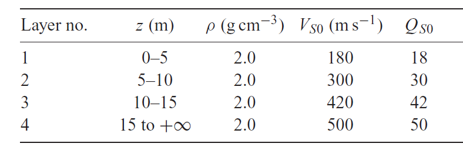
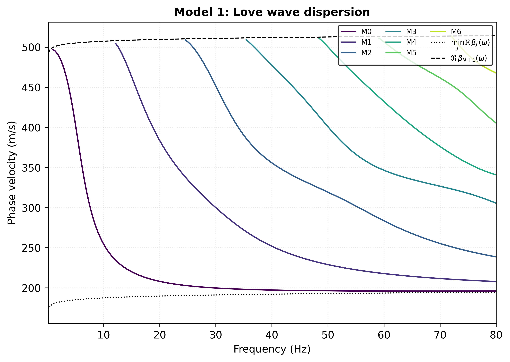
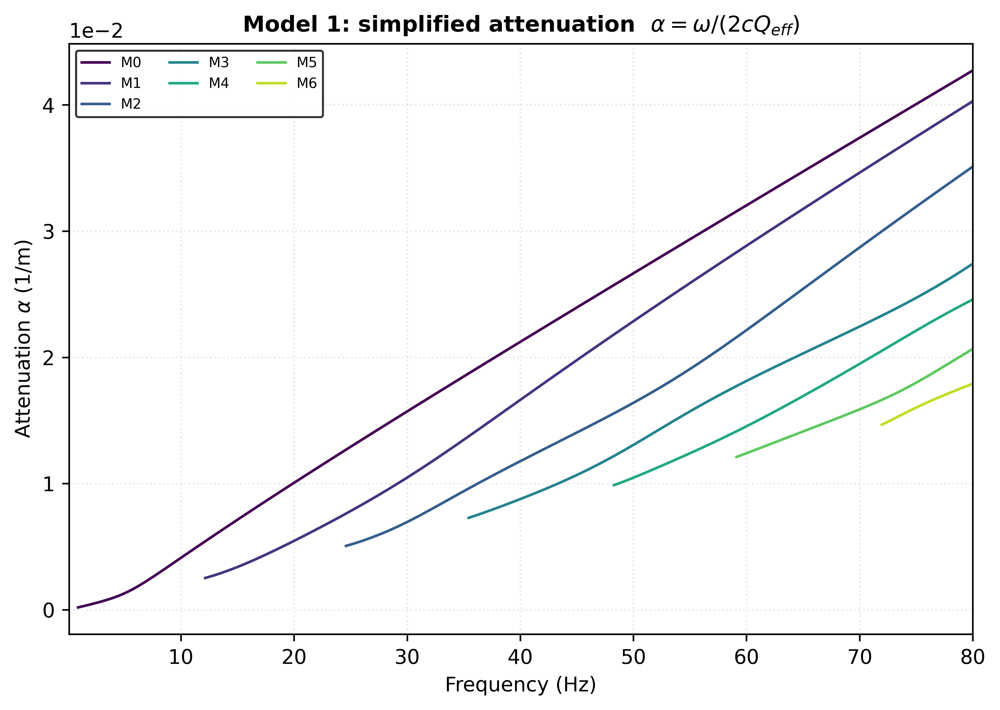
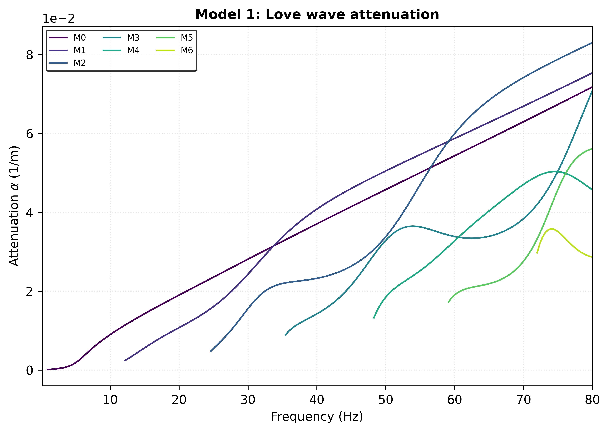

# Dispersion and Attenuation of Love Waves in a Stack of N Isotropic Viscoelastic Layers over a Half-Space: A Thomson–Haskell Propagator Matrix Approach

This repo contains detailed mathematical derivations and Python code for my Geophysical Wave Propagation (GEOP 602) semester project on the <u><b>dispersion and attenuation of Love waves in an isotropic viscoelastic medium</b></u>.

The theoretical framework follows the classic work of [Thomson (1950)](#references) and [Haskell (1953)](#references) as implemented in [Chen et al. (2025)](#references). Model 1 used in my project is from Table 4 of [Yuan et al. (2024)](#references). The attenuation coefficient is computed via the complex-velocity approach.

## Repository Contents

- `Project.txt` – LaTeX source of the full write-up (compile with `pdflatex` + `biber`; `References.bib` and `GMB.png` are its inputs). `Project.pdf` is the compiled document.
- `Love Waves/love_engine.py` – the numerical engine: Thomson–Haskell propagator, constant-Q Generalized Maxwell body fit, and complex-root dispersion solver.
- `Love Waves/Complex Velocity Method.ipynb` – driver notebook that produces the figures below and other models used in the study.
- `Plots/` – contains generated figures for Model 1.

## Results

**Phase Velocity Dispersion Curve**

**Attenuation Coefficient Curve (Simplified Q averaging):** This assumes weak attenuation () and uses a thickness-weighted average quality factor over the layers (see the notebook for the derivation).

With the  convention, the complex wavenumber is  with . For small attenuation (), the standard formulation is:

where  is the real-valued phase velocity at low loss and  is the complex velocity.

Starting from the wavenumber:

Comparing this to , we immediately identify:

**Attenuation Coefficient Curve (Using Complex Velocity Method)**

**The Love-wave modal solutions in the frequency–phase velocity–attenuation coefficient domain.**

---

## References

1. **Yuan, S., Pan, L., Shi, C., Song, X., & Chen, X. (2024).**  
   *Computation and analysis of surface wave dispersion and attenuation in layered viscoelastic–vertical transversely isotropic media by the generalized R/T coefficient method.*  
   **Geophysical Journal International, 238**(3), 1505–1529.

2. **Chen, K., Li, Z., Wang, M., & Sacchi, M. D. (2025).**  
   *Theoretical calculation of dispersion and attenuation curves of deep-guided wave in viscoelastic media.*  
   **Geophysical Journal International, 243**(3), ggaf393.

3. **Haskell, N. A. (1953).**  
   *The dispersion of surface waves on multilayered media.*  
   **Bulletin of the Seismological Society of America, 43**(1), 17–34.

4. **Thomson, W. T. (1950).**  
   *Transmission of elastic waves through a stratified solid medium.*  
   **Journal of Applied Physics, 21**(2), 89–93.
